# Lab 01: Create and Deploy an Azure AI Document Intelligence Custom Model

### Estimated Duration: 120 Minutes

## Lab Scenario

Contoso Ltd. is modernizing its document processing and enterprise search system by using Azure AI services to automate the extraction, indexing, and analysis of business documents such as invoices, contracts, and forms. In this hands-on lab, you will act as a Cloud Consultant and help Contoso build an intelligent business automation solution using Azure AI Document Intelligence, Azure AI Search, and Azure OpenAI. You will create and train a custom document processing model, build a BPA pipeline for automated document ingestion, configure Azure AI Search to index extracted data, and additionally configure Managed Identity access for the Azure AI Search service to securely connect with Azure Storage resources.

## Overview

In this lab, you will create (train) an Azure AI Document Intelligence custom model using a sample training dataset. Custom models extract and analyze distinct data and use cases from forms and documents specific to your business. To create a custom model, you label a dataset of documents with the values you want to extract and train the model on the labeled dataset. You only need five examples of the same form or document type to get started. For this lab, you will use the dataset provided at [Custom Model Sample Files](https://github.com/MSUSAzureAccelerators/Azure-OpenAI-and-Form-Recognizer-Workshop/tree/main/SampleInvoices/Custom%20Model%20Sample).

## Lab Objectives

In this lab, you will complete the following tasks:

* Task 1: Creating an Azure AI Document Intelligence Resource
* Task 2: Train and Label data
* Task 3: Build a new pipeline with the custom model module in BPA
* Task 4: Configure Managed Identity Access for Azure AI Search in the storage account
* Task 5: Configure Azure AI Search
* Task 6: Use Sample Search Application [Read Only]

## Task 1: Creating an Azure AI Document Intelligence Resource

In this task, you will create an Azure AI Document Intelligence project using Document Intelligence Studio. You’ll configure the project by selecting a Cognitive Services resource and creating a Storage Account to prepare the environment for custom model training.

1. Open a new tab and navigate to **Document Intelligence Studio** using the provided link.

   ```
   https://documentintelligence.ai.azure.com/studio
   ```

1. You will be navigated to **Content Understanding Studio** page, select **Sign In** option from the top right corner.

   

1. Select your already signed in **ODL_User <inject key="Deployment ID" enableCopy="false"/>** account.

   

   > **Note**: If you have already signed in to the Azure Portal in the previous tasks, you can skip the below steps and proceed to step 6. Otherwise, follow these steps to sign in before proceeding further.

1. If you see the **Sign in to Microsoft Azure** tab, enter the following email/username and click on **Next (2)**.
   
   * **Email/Username:** <inject key="AzureAdUserEmail"></inject> **(1)**

   

1. Now enter the following temporary password and click on **Sign in (2)**.
   
   * **Temporary Access Pass:** <inject key="AzureAdUserPassword"></inject> **(1)**

   

1. In the **Content Understanding Studio** page, scroll down and from **Document Intelligence** section choose **Start with Document Intelligence**.

   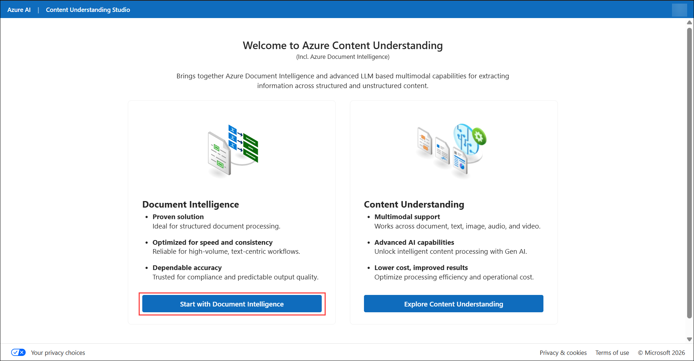

1. In Document Intelligence Studio, scroll down to **Custom Models**, under **Custom extraction model**, choose **Get started**.

   .png)

1. If asks to Sign in, use the same **ODL_User <inject key="Deployment ID" enableCopy="false"/>** to login used to login Azure.

   

1. On the **Custom extraction model** page, click **+ Create a project** under **My Projects**.

   

1. On the **Custom extraction models** tab, under **Enter project details**, enter the following details and click on **Continue** **(3)**.
    
   - Project name: **testproject** **(1)**.

   - Description: **Custom model project** **(2)**.

     

1. On the **Configure service resource** tab, enter the following details and click on **Continue (5)**.

   - Subscription: Select your **Default Subscription** **(1)**.

   - Resource group: **business-process-<inject key="Deployment ID" enableCopy="false"/>** **(2)**.

   - Document Intelligence or Cognitive Service Resource: Select the available Azure AI Search (Cognitive Service) **cogservicesbpass{suffix}** **(3)**.

   - API version: **2024-11-30 (4.0 General Availability)** **(4)**.

      

1. On the **Connect training data source** tab, enter the following details and click on **Continue** **(8)**.

    - Subscription: Select your **Default Subscription** **(1)**.
   
    - Resource group: **business-process-<inject key="Deployment ID" enableCopy="false"/>** **(2)**.
   
    - Check the box to **Create new storage account** **(3)**
   
    - Storage account name: **formrecognizer<inject key="Deployment ID" enableCopy="false"/>** **(4)**.
   
    - Location: **East US** **(5)**.
   
    - Pricing tier: **Standard_LRS Standard** **(6)**.
   
    - Blob container name: **custommoduletext** **(7)**.
   
      

1. On the **Review and create** tab, validate the information and click **Create project**.

   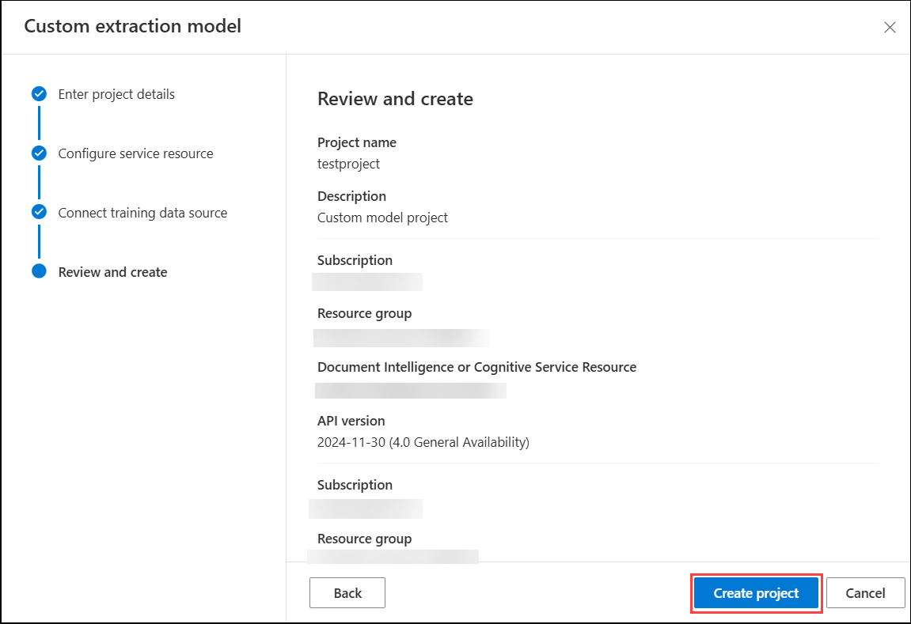

> **Congratulations** on completing the task! Now, it's time to validate it. Here are the steps:
> - Hit the Validate button for the corresponding task. If you receive a success message, you can proceed to the next task. 
> - If not, carefully read the error message and retry the step, following the instructions in the lab guide.
> - If you need any assistance, please contact us at cloudlabs-support@spektrasystems.com. We are available 24/7 to help

  <validation step="60c13090-77ec-4831-9df3-a8cf1c72a307" />

## Task 2: Train and Label data

In this task, you will upload and label six training documents to define a custom field for extraction. After labeling, you'll train the Document Intelligence model and validate its accuracy by testing it with sample documents.

1. On the **Label data** page of your custom extraction model project, click **Browse for files** to upload your sample documents.

   

1. On the file explorer, paste the following path `C:\Users\Public\Desktop\Data\Custom Model Sample` **(1)** hit **enter**, select all train JPEG files **train1 to train6** **(2)**, and click **Open** **(3)**.

   

1. Once uploaded, in the **Start labeling now** pop-up, select **Run now** under the **Run layout** column.

   

1. On the **Label data** page, click **+ Add a field** **(1)**, then select **Field** **(2)** from the dropdown. Enter the field name as `Organization_sample` **(3)** and press **Enter**.

   

   

1. On the **Label data** page, select the text **CONTOSO** **(1)** from the document preview. From the label dropdown, choose **Organization_sample** **(2)**. Repeat for all **6** documents.

   

1. On the **Label data** page, after labeling all six documents, click on **Train** in the top right corner.

   

1. On the **Train a new model** page, specify the Model ID as **customfrs** **(1)**, Model description as **custom model** **(2)**, from the drop-down select **Template** **(3)** as Build Mode and click on **Train** **(4)**.

   

1. On the **Training in progress** dialog opens. click on **Go to Models**

   

1. On the **Models** page, wait until the **Status** of your model changes to **succeeded** **(1)**. Then, select the model **customfrs** **(2)** and click on **Test** **(3)** from the top menu.

   

1. From the left-side menu, navigate to the **Test model** **(1)** page and click **Browse for files (2)**.

   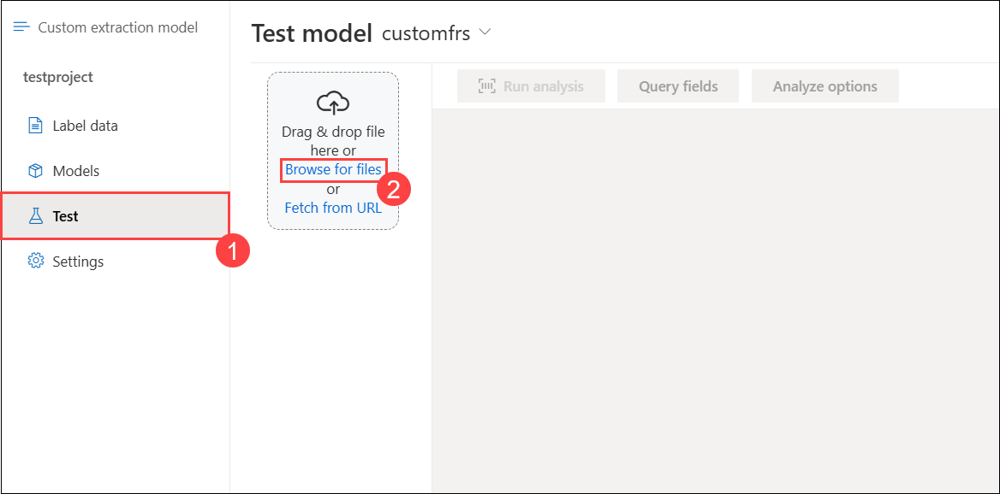

1. On the file explorer, paste the following path `C:\Users\Public\Desktop\Data\Custom Model Sample` **(1)** hit **enter**, select all test JPEG files **test1 and test2** **(2)**, and click **Open** **(3)**.

   

1. On the **Test model** page, Once uploaded, select **test2.jpeg (1)** model, and click on **Run analysis** **(2)**, Now you can see on the right-hand side that the model was able to detect the field **Organization_sample** **(3)** we created in the last step along with its confidence score(*may vary from screenshot)*.

   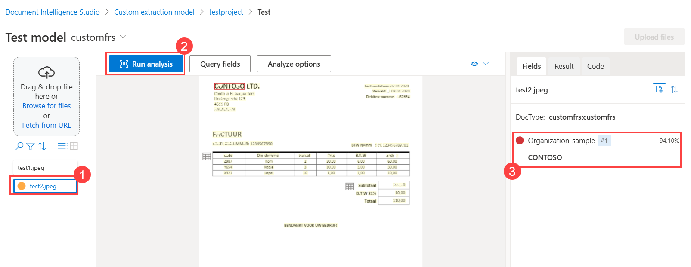

## Task 3: Build a new pipeline with the custom model module in BPA

In this task, you will create a custom document processing pipeline using the Business Process Automation (BPA) Accelerator. You’ll integrate your trained custom model into the pipeline and upload documents for automated extraction and processing.

1. On the Azure Portal, navigate to the Resource groups and select the resource group **business-process-<inject key="Deployment ID" enableCopy="false"/>**.

   

1. On the **Resource group** page, search **webappbpa (1)**, and then select  **webappbpa{suffix} (2)** from the results, ensuring the Resource type **Static Web App (3)**.

   

1. On the **Overview** page of **Static Web App** page, click on **View app in browser**.

      

1. Once the **Business Process Automation Accelerator** page loads successfully, scroll down to the section titled **"What would you like to do?"** Under this section, click on the **Create/Update/Delete Pipelines**. 

   

1. On the **Create Or Select A Pipeline** page, Enter New Pipeline Name as **workshop** **(1)**, and click on the **Create Custom Pipeline** **(2)**. 

   

1. On the **Select a document type to get started** page, select **PDF Document**

   

1. On the **Select a stage to add it to your pipeline configuration** page, click on **Form Recognizer Custom Model (Batch)**.

   

1. On the **Model ID** pop-up. Enter the Form Recognizer Custom Model ID as **customfrs** in the **Model ID** field **(1)**, and then click on **Submit** **(2)**.

   

1. On the **Select a stage to add it to your pipeline configuration** page, scroll down to review the **Pipeline Preview**, and click on **Done**.

   

1. On the **Pipelines workshop** page, click on **Home**. 

   

1. On the **Business Process Automation Accelerator** page, scroll down to the **What would you like to do?** section, then click on **Ingest Documents**.

   

1. On the **Upload a document to Blob Storage** page, from the drop-down, **Select a Pipeline** with the name **workshop** **(1)**, and click on **Upload or drop a file right here (2)**.

   

1. For documents, paste the following path `C:\Users\Public\Desktop\Data\Lab 1 Step 3.7` **(1)** and hit enter. Select the invoice files one by one **(2)** and click **Open** **(3)**. You can upload multiple invoices one by one.

   

## Task 4: Configure Managed Identity Access for Azure AI Search in the storage account

In this task, you will configure Managed Identity access for the Azure AI Search service to securely access data stored in the Azure Storage Account. You will assign the **Storage Blob Data Reader** role to the Azure AI Search managed identity using Azure Role-Based Access Control (RBAC).

1. On the Azure Portal, in the top search bar, search for **Storage accounts** **(1)** and select **Storage accounts** **(2)** from the search results.

   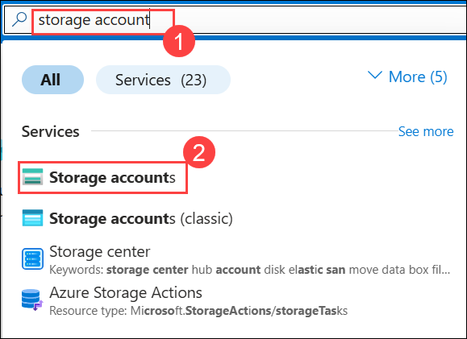

1. On the **Storage accounts** page, select the storage account named similar to **bpa{suffix}**.

   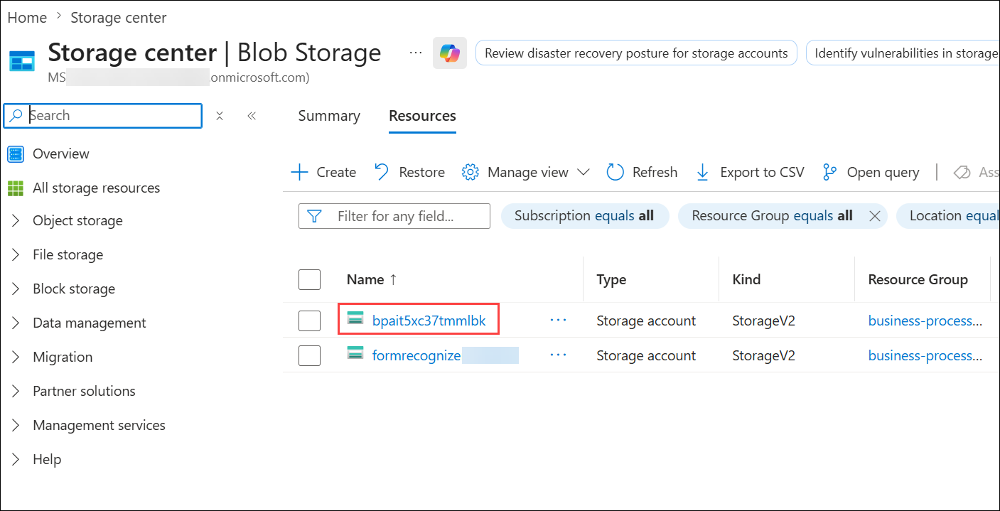

1. On the left-side navigation menu, select **Access control (IAM)** **(1)**. Then click on **+ Add** **(2)** and select **Add role assignment** **(3)**.

   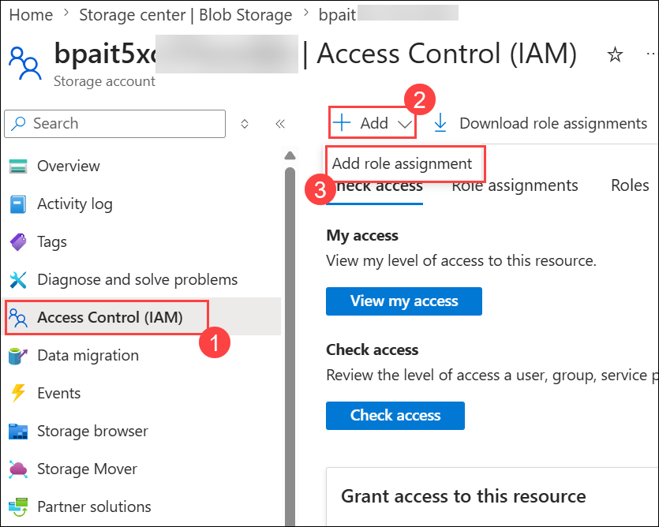

1. On the **Add role assignment** page, search for **Storage Blob Data Reader** **(1)**, select the role **Storage Blob Data Reader** **(2)**, and click on **Next** **(3)**.

   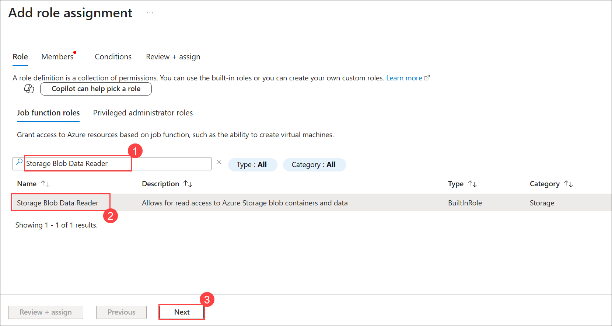

1. Under the **Members** tab, for **Assign access to**, select **Managed identity** **(1)**.Click on **+ Select members** **(2)**.On the **Select managed identities** pane, enter the following details:

   - Subscription: Select your default subscription **(3)**.
   - Managed identity: Select **Search service** **(4)**.
   - Select the Azure AI Search service named similar to **bpa{suffix}** **(5)**.
   - Click on **Select** **(6)**.
   - Click on **Review + assign** **(7)**.

      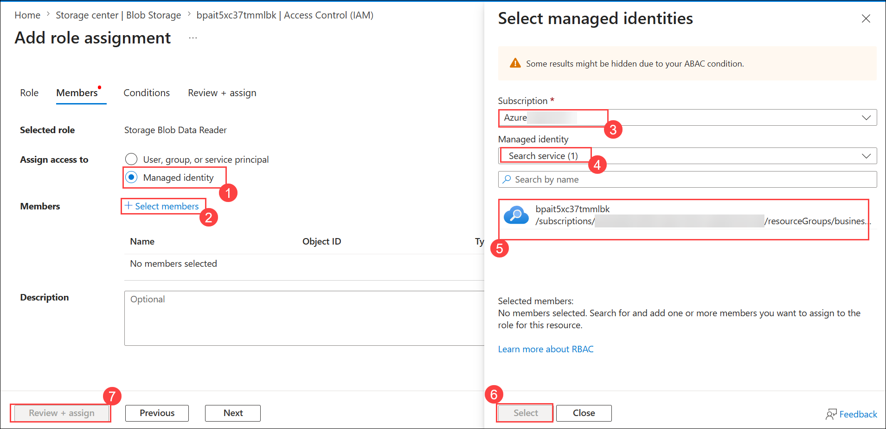

1. On the **Review + assign** page, review the configuration settings and click on **Review + assign** to complete the role assignment.

   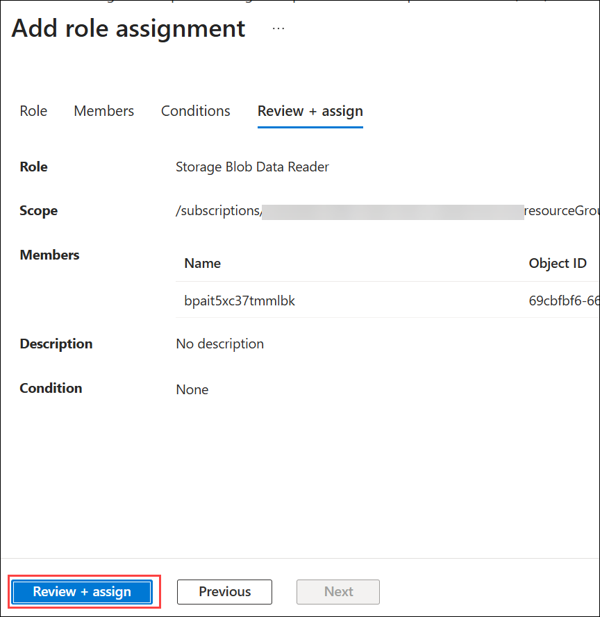

## Task 5: Configure Azure AI Search 

In this task, you will configure Azure AI Search to index the extracted document data stored in Azure Blob Storage. You'll define a data source, customize indexing settings, and create an indexer to make the custom model output searchable.

1. Navigate back to the resource group page, select **Search service** with a name similar to **bpa{suffix}**.

   

1. On the **Search service** page, click on **Import data**.

   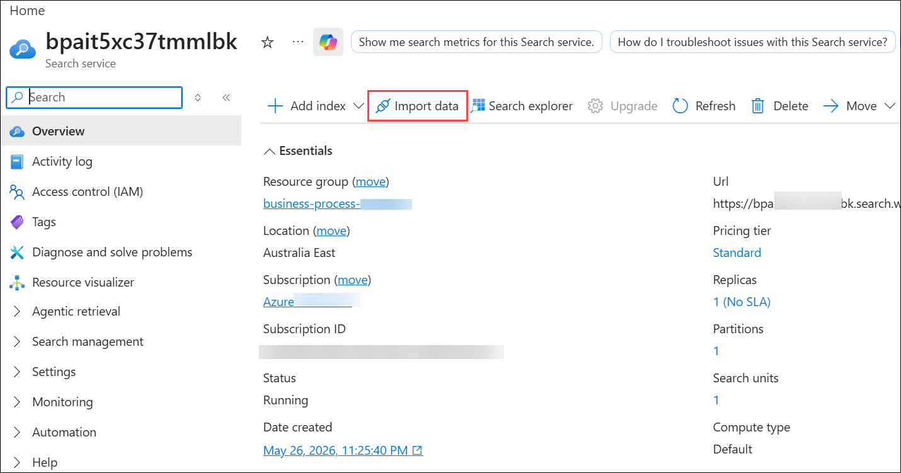

1. Select **Azure Blob Storage (1)** as the data source and click on **Keyword Search (2)**.
  
   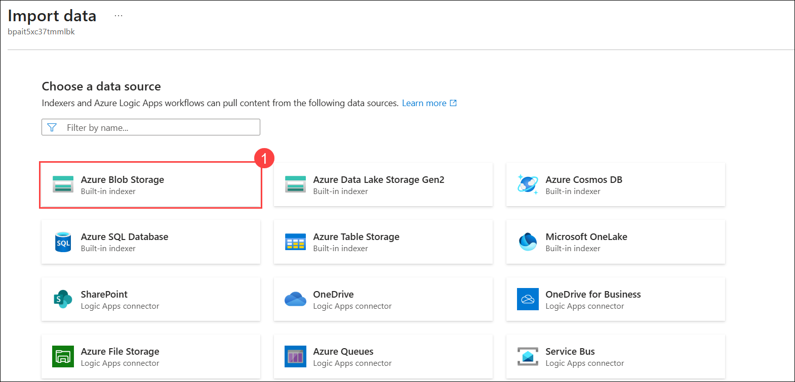

   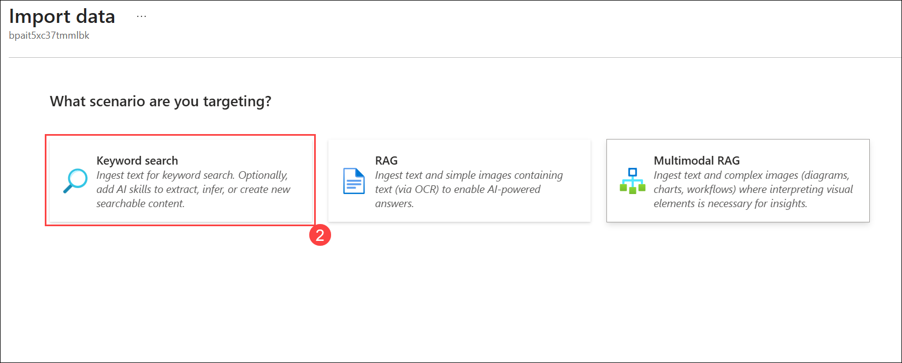

1. Enter the following details for **Connect to your data**.

   - Subscription: Select **Existing Subscription** **(1)**.
   - Storage Account: Select **bpa{suffix}** **(2)**.
   - Blob Container: Select **results** **(3)**.
   - Blob folder: **Rename to workshop** **(4)**.
   - Parsing mode: **JSON (5)**.
   - Click **Next (6)**.
     
      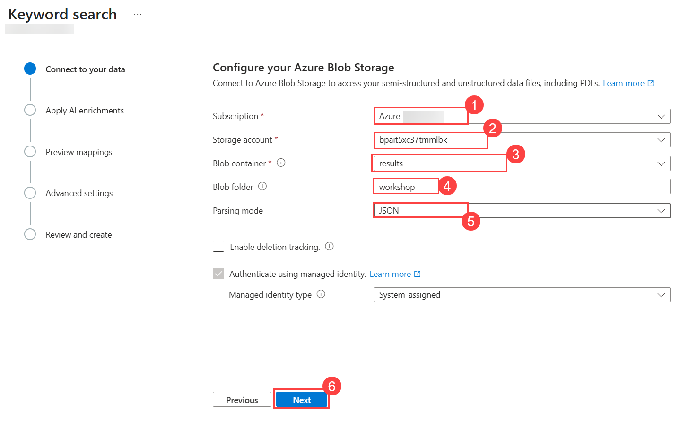

1. Click **Next** on **Apply AI enrichment** screen.

   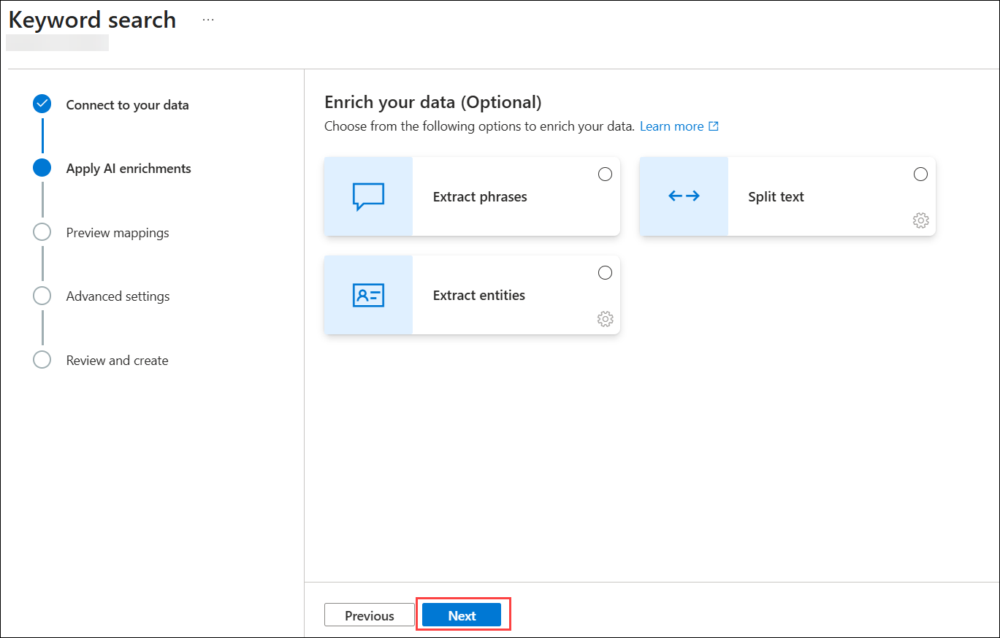
   
1. Click **Add field (1)** on Preview mappings screen, scroll down and select index on source column now click on (...) **ellipses icon (2)** on right of the column and select **Configure field (3)**.

   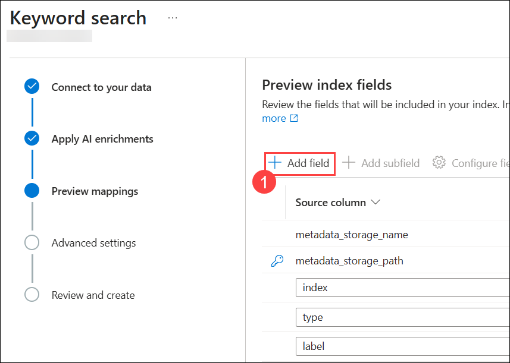

   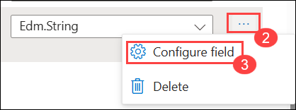

1. Enter the following details in the Configure field

   - Field name: **azureblob_index (1)**
   - Type: **Edm.String (2)**
   - Configure attributes: Select **Retrievable (3)** and **Searchable (4)**
   - Click on **Save (5)**

     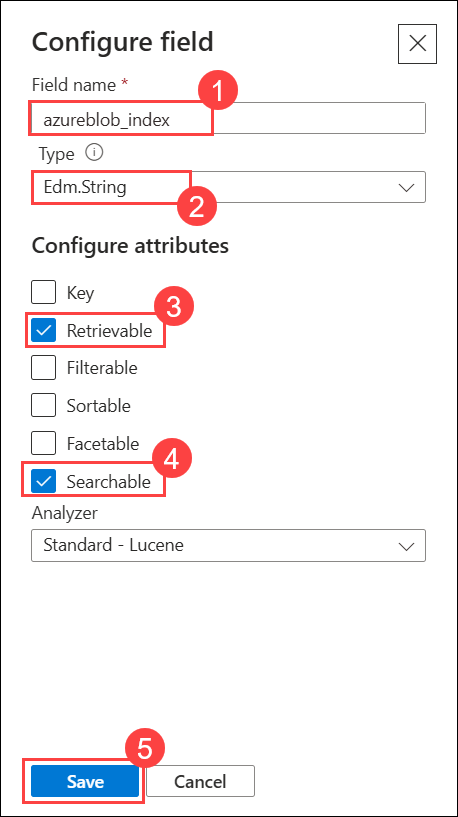

1. Now Scroll up and Expand the **aggregatedResults (1)** > **customFormRec (2)** > **documents (3)** > **fields (4)** under it, expand **Organization (5)**. Make the three fields Facetable (**type, valueString & content) (6)** by now click on **(...) ellipses icon (7)** on right of the column and select **Configure field (8)**.

   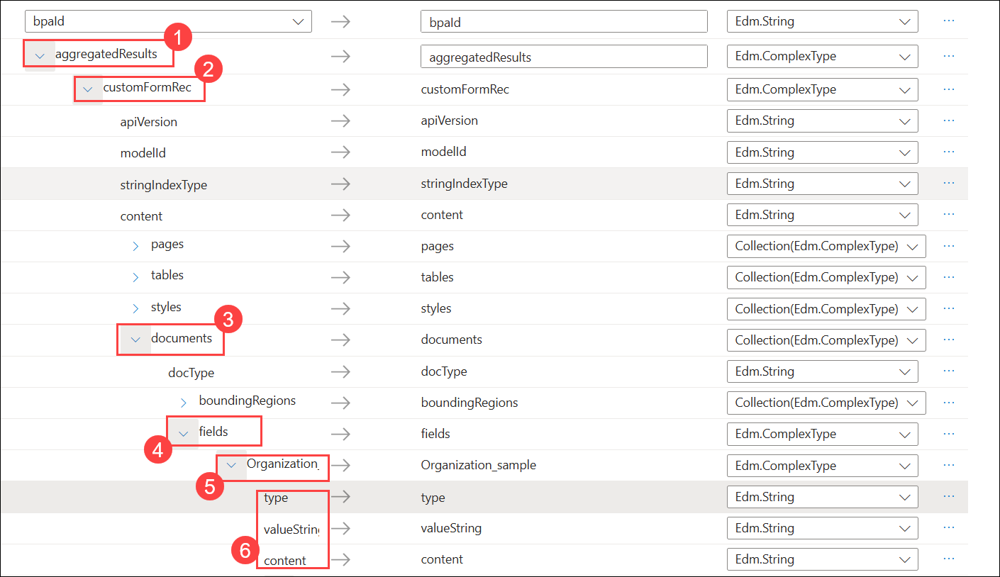

   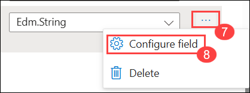

1. Enter the following details in the Configure field

   - Field name: **type (1)**
   - Type: **Edm.String (2)**
   - Configure attributes: Select **Facetable (3)**
   - Click on **Save (4)**

      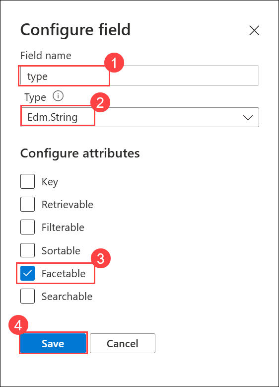

      >**Note:** If any field with values as id is giving error, delete that field by clicking (...) ellipses icon  on the right side.

1. On Advanced settings screen leave all fields as default and click **Next**.
    
   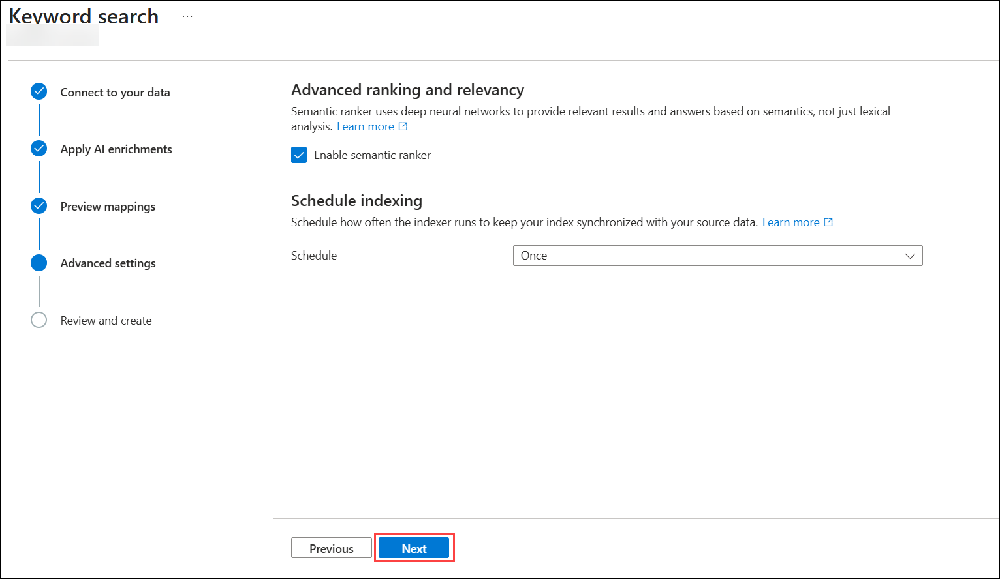
   
1. On Review and create screen, enter Objects name prefix as **azureblob-indexer (1)** and click **Create (2)**.

   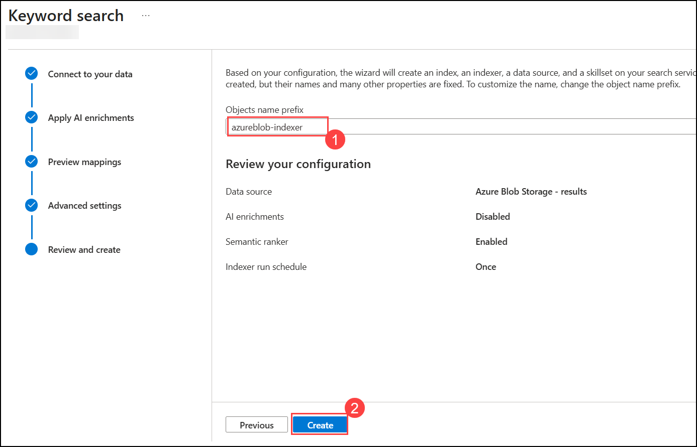

> **Congratulations** on completing the task! Now, it's time to validate it. Here are the steps:
> - Hit the Validate button for the corresponding task. If you receive a success message, you can proceed to the next  task. 
> - If not, carefully read the error message and retry the step, following the instructions in the lab guide.
> - If you need any assistance, please contact us at cloudlabs-support@spektrasystems.com. We are available 24/7 to help

  <validation step="52b89379-3a35-4829-b65b-466fadb99e86" />

## Task 6: Use Sample Search Application [Read Only]

In this task, you will explore the Sample Search Application to verify the results indexed by Azure AI Search. This allows you to view and validate searchable content extracted by your custom model.

1. Navigate back to the **Business Process Automation Accelerator** home page, under the section **What would you like to do?**, click on **Sample Search Application**.

   

1. On the **Sample Search Application** page, in the search bar, enter **invoice1** **(1)** and click on **Search** **(2)** to view results.

   

## Summary

In this lab, you have completed the following:

- Created an Azure AI Document Intelligence resource.

- Trained and labeled data for a custom model.

- Built a new pipeline using the custom model module in BPA.

- Configured Managed Identity Access for Azure AI Search in the storage account

- Configured Azure AI Search.

### Now, click on **Next >>** from the lower right corner to move on to the next lab.


